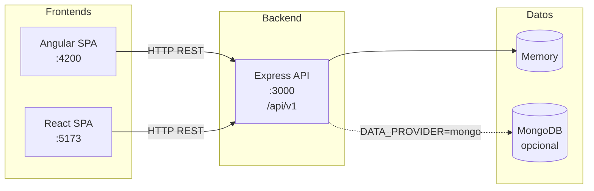
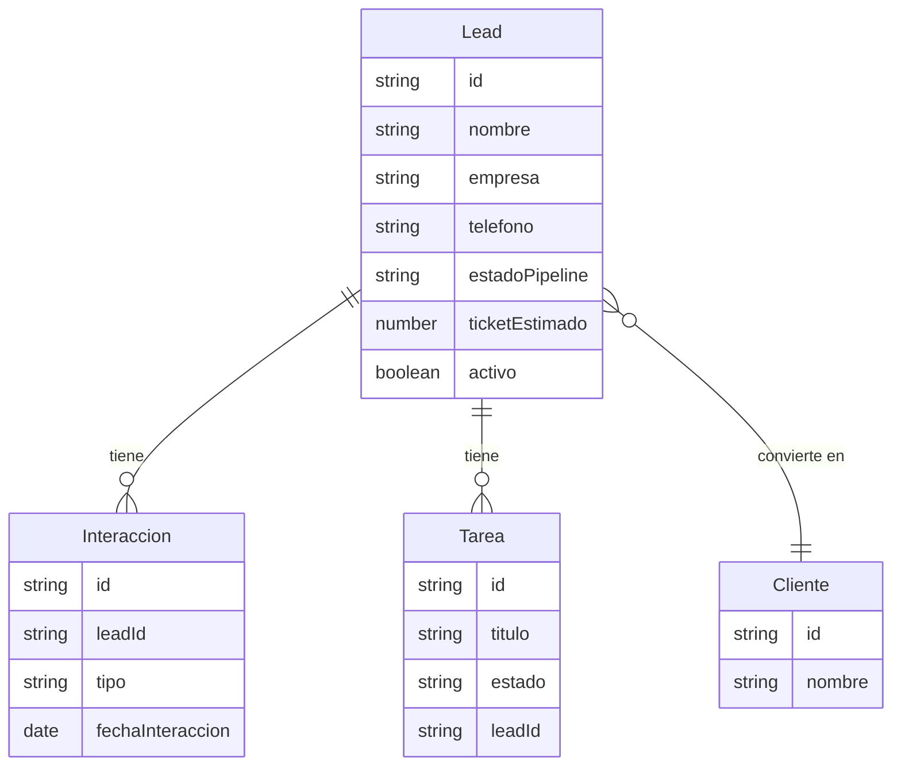

# Diagrama de arquitectura — NakedCRM Lite

## Vista general del sistema



## Flujo de capas (Backend)

```mermaid
flowchart TB
  subgraph Cliente
    Req[Petición HTTP]
  end
  subgraph Express
    Routes[Routes\n/api/v1/leads|interacciones|tareas|...]
    Ctrl[Controllers]
    MW[Middlewares\nCORS, JSON, errorHandler]
  end
  subgraph Lógica
    Svc[Services\nlógica de negocio]
  end
  subgraph Persistencia
    Repo[Repositories\nmemory | mongo]
  end
  Req --> Routes --> Ctrl --> Svc --> Repo
  Repo --> Svc --> Ctrl --> Res[Respuesta JSON]
  Req --> MW
  Res --> MW
```

## Entidades principales



Puedes visualizar estos diagramas en cualquier visor de Mermaid (GitHub, GitLab, VS Code con extensión Mermaid, o [mermaid.live](https://mermaid.live)).
